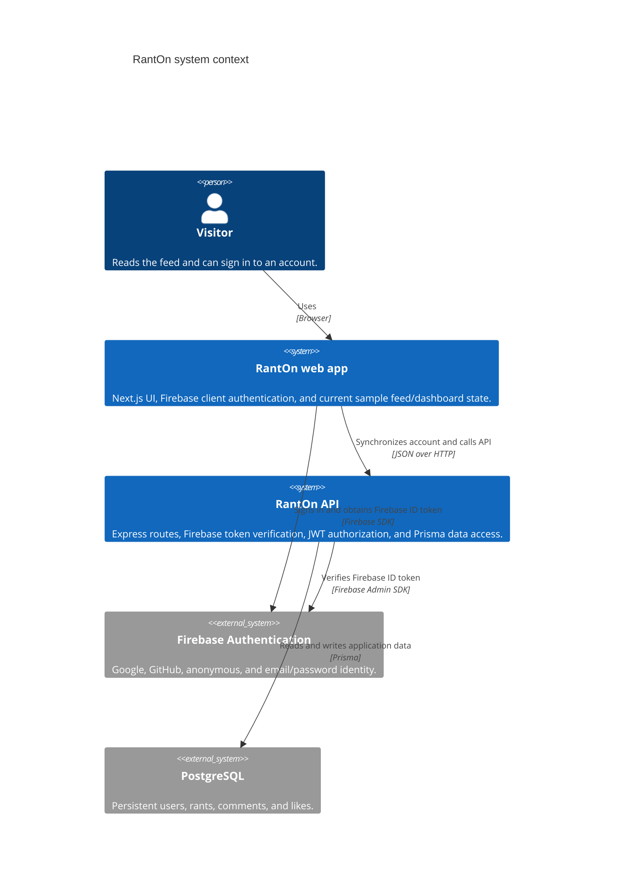

# Architecture

RantOn is split into two independently run applications. The browser-facing app uses Next.js App Router and React; a TypeScript Express service exposes the persistence API. PostgreSQL stores accounts and discussion data through Prisma. Firebase Authentication manages client sign-in, and Firebase Admin verifies Firebase ID tokens received by the API.

## System context

## Components and responsibilities

- **Web app (`frontend/`)** — `app/` contains the home, authentication, and dashboard routes. `context/AuthContext.tsx` observes Firebase client auth state. `components/` provides the shared navigation and UI primitives. The feed and dashboard currently render local sample data; they do not fetch or persist rant activity.
- **API (`backend/src/app.ts`)** — Loads environment configuration, installs JSON and URL-encoded parsers plus CORS, and mounts `/api/users`, `/api/rants`, `/api/likes`, and `/api/comments`.
- **Routes and controllers** — `routes/` maps HTTP requests to `controllers/`. Controllers use the shared Prisma client in `src/prismaClient.ts` to perform the requested persistence operations.
- **Authentication** — The web app signs in with Firebase and submits its Firebase ID token to `POST /api/users/auth`. The API verifies it with Firebase Admin, upserts the local user, and returns a signed seven-day JWT. Protected routes use `authenticateUser` to verify that JWT and load the corresponding user. Callers must send it as `Authorization: Bearer <token>`.
- **Data layer** — `backend/prisma/schema.prisma` defines `User`, `Rant`, `Comment`, and `Like`, including foreign-key relationships and uniqueness constraints. SQL migrations in `backend/prisma/migrations/` evolve the PostgreSQL schema.

## Main data flows

1. **Sign-in and account sync:** A visitor authenticates with Firebase in the browser. The client obtains a Firebase ID token and posts it to the API. Firebase Admin validates the token; Prisma creates or updates the user keyed by Firebase UID. The API responds with the user record and an API JWT.
2. **Discussion API:** A client requests or mutates rants, comments, or likes through the relevant `/api` route. Read routes query Prisma directly. Mutation routes first validate the API JWT; controllers associate the authenticated user with the new record or constrain deletion to that user's own record.
3. **Current UI state:** Home-feed posting/commenting and dashboard statistics are currently local or mocked. The frontend does not yet use the API JWT to call the rant, comment, or like endpoints, so API persistence is not reflected in those screens.

The API listens on port `8000` by default in `src/app.ts`; the Next.js development server uses port `3000` by default. See [README.md](./README.md) for local setup and [API.md](./API.md) for the HTTP contract.
